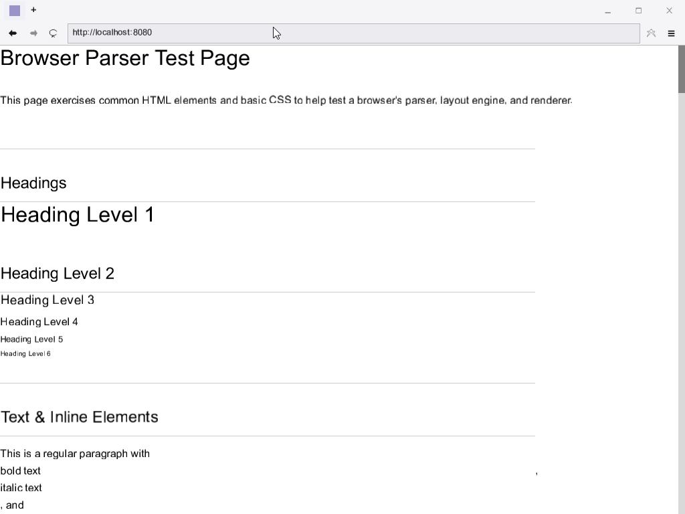

# browser — Web Browser from Scratch in C++20

A from-scratch web browser built in modern C++ with its own HTML5 parser, CSS engine (Flexbox + Grid), JavaScript runtime (parser → bytecode VM → x86-64 JIT), networking stack (HTTP/1.1, HTTP/2, TLS 1.3), and an OpenGL-rendered UI.



## Build

Requires GCC 15.2+, CMake 3.20+, and Ninja.

```bash
cmake -G Ninja -DCMAKE_CXX_COMPILER=g++ -S . -B build
ninja -C build browser          # Build browser executable
ninja -C build run_tests        # Run all tests
```

## Components

| Directory | Description |
|-----------|-------------|
| `html/` | HTML5 tokenizer, parser, DOM tree construction |
| `css/` | CSS tokenizer, parser, cascade, layout (block/inline, Flexbox, CSS Grid) |
| `js/` | JavaScript engine: lexer, parser, bytecode compiler, stack VM, mark-sweep GC, x86-64 JIT |
| `net/` | Networking: DNS, HTTP/1.1, HTTP/2 (HPACK, multiplexing), TLS 1.3 (X25519, AES-GCM, ChaCha20-Poly1305), deflate, tracker blocker |
| `platform/` | Win32 window, OpenGL context, event loop abstraction |
| `render/` | OpenGL 2D renderer, TrueType font rasterization, text rendering, paint display list |
| `browser/` | Browser chrome (tabs, URL bar, navigation, history, bookmarks, settings, telemetry) |
| `tests/` | Test suite with custom framework, ~30 test executables |
