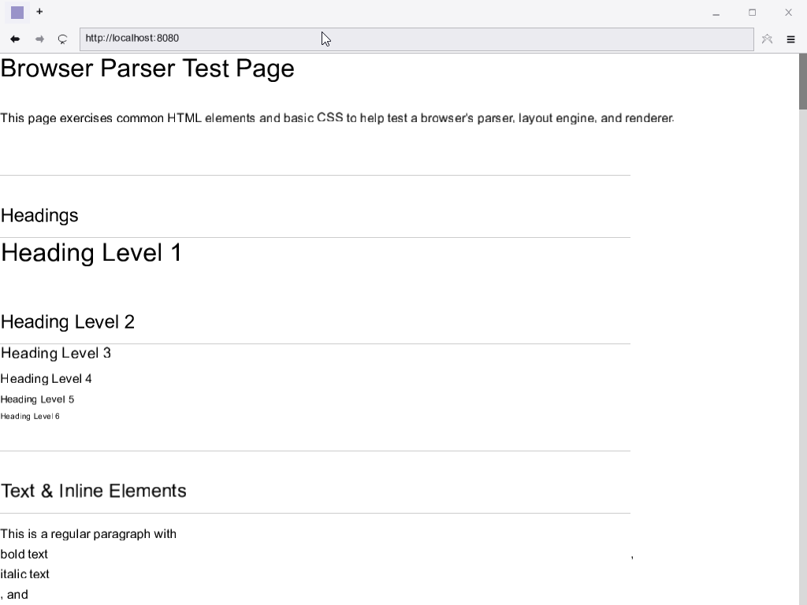

# browser — Web Browser from Scratch in C++20

A from-scratch web browser built in modern C++20: HTML5 parser, CSS engine (cascade, Flexbox, Grid, table, multi-column, animations), JavaScript runtime (bytecode VM + x86-64 JIT, mark-sweep GC, 15 built-in modules including Promise/fetch/XHR), full networking stack (DNS over UDP, TCP via IOCP, TLS 1.3 with X25519/AES-GCM/ChaCha20-Poly1305, HTTP/1.1, HTTP/2 with HPACK, WebSocket), image decoders (BMP/PNG/GIF/JPEG), and OpenGL 3.3 paint engine — all with zero third-party dependencies.



## Philosophy

**Zero dependencies.** No Boost, Qt, WebKit, Chromium, libcurl, OpenSSL, zlib, FreeType, or any other third-party library. Only the C++ standard library, Win32 API, and OpenGL.

**Embedded base font.** Open Sans Regular (122KB) compiled into the binary guarantees text always renders. Web fonts via `@font-face` are fetched and decoded on top of it.

**No compositor.** Single-threaded rendering — no separate compositor thread, no software tile cache, no layer tree. OpenGL draws directly.

**No telemetry, ever.** Local performance counters only. Never phones home.

**Secure by default.** TLS 1.3 only. Same-origin policy, CSP, CORS, HSTS enforced.

**Built with AI.** Developed collaboratively with AI models — proving what's possible when human intent meets machine assistance.

## Pipeline

```
URL → DNS (UDP, Google) → TCP (IOCP) → TLS 1.3 → HTTP/1.1 or HTTP/2
                                    ↓
                              HTML5 Parser ←── Preload Scanner
                              /     |    \
                             ↓      ↓     ↓
                        CSS Parser  JS  Image Decoders (BMP/PNG/GIF/JPEG)
                             ↓       ↓
                      Cascade Engine  Bytecode Compiler
                             ↓       ↓
                        Layout Engine  VM / JIT (x86-64)
                             ↓
                         Paint System
                             ↓
                         OpenGL 3.3 → Win32 Window
```

## Build

Requires GCC 15.2+, CMake 3.20+, and Ninja.

```bash
cmake -G Ninja -DCMAKE_CXX_COMPILER=g++ -S . -B build
ninja -C build browser          # Build browser executable
ninja -C build builtins_test    # Build any single test executable
./build/builtins_test.exe       # Test executables run directly (exit code = failures)

# External pipeline harness (DOM/CSS/cascade/layout/display-list vs reference parsers)
.\tools\run_tests.ps1 -quick    # 14 representative tests
.\tools\run_tests.ps1 -full     # Full suite — pre-commit only, single process
```

## Components

| Directory | Files | LOC | Description |
|-----------|-------|-----|-------------|
| `async/` | 10 (hdr) | 703 | C++20 coroutines: task, channel, executor, thread pool, allocators |
| `platform/` | 8 | 1,244 | Win32 window + WGL, event loop, audio (waveOut) |
| `image/` | 7 | 1,274 | Hand-written BMP/PNG/GIF/JPEG decoders |
| `net/` | 66 | 9,544 | DNS over UDP, TCP via IOCP, TLS 1.3 (X25519, AES-GCM, ChaCha20-Poly1305), HTTP/1.1, HTTP/2 (HPACK, stream mux), WebSocket, deflate/gzip, CSP/HSTS, cookies, localStorage, tracker blocking, crypto primitives |
| `html/` | 38 | 7,963 | HTML5 tokenizer (13 insertion modes), tree-construction parser with foster parenting / adoption agency / template fragments, DOM, preload scanner, resource loader, hit testing |
| `css/` | 37 | 9,695 | Tokenizer, parser, cascade engine, layout (block/inline, Flexbox, CSS Grid, table, multi-column, positioned), animations + transitions |
| `js/` | 53 | 8,793 | ECMAScript lexer, parser, bytecode compiler, stack VM, x86-64 JIT, mark-sweep GC, 15 built-in modules (Date, Promise, Error hierarchy, JSON, RegExp…), DOM bindings, fetch/XHR |
| `render/` | 50 | 17,759 | OpenGL 3.3 renderer, batch-quad mesh, paint display list + executor, TrueType font parser + 4×4 coverage rasterizer + glyph atlas, monochrome emoji atlas, Canvas 2D, SVG, form controls, audio/video elements |
| `browser/` | 32 | 5,936 | Chrome UI (tabs, address bar, toolbar, titlebar, menus), async page loading, history, bookmarks, settings, telemetry, download manager, session save/restore, devtools |
| `tests/` | 44 | 9,338 | Custom minimal test framework, 40 test executables across all subsystems |
| `src/` | 1 | 1,283 | Program entry point, CLI test runner, JSON fixture emitter |

**Total: 346 files, ~73K lines of C++20**
